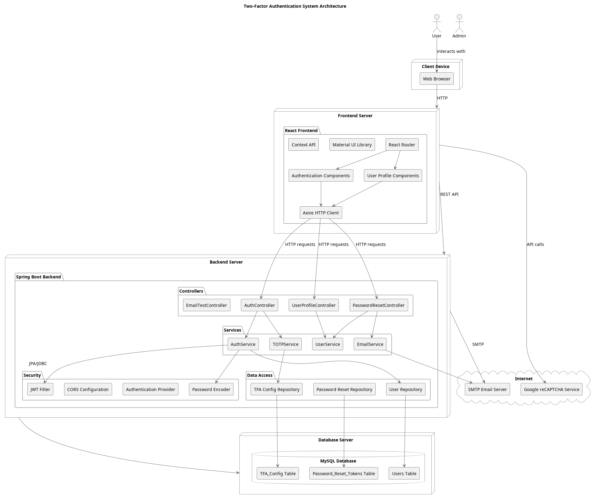

# Two-Factor Authentication System: Project Analysis and Design Documentation

## Table of Contents
1. [Project Overview](#project-overview)
2. [System Architecture](#system-architecture)
3. [Use Case Analysis](#use-case-analysis)
4. [Class Structure](#class-structure)
5. [Sequence Diagrams](#sequence-diagrams)
6. [Activity Diagrams](#activity-diagrams)
7. [Entity-Relationship Model](#entity-relationship-model)
8. [Data Flow Analysis](#data-flow-analysis)
9. [User Interface Design](#user-interface-design)
10. [Security Considerations](#security-considerations)
11. [Team Contributions](#team-contributions)
12. [Setup Instructions](#setup-instructions)

## Project Overview

The Two-Factor Authentication (2FA) System is a robust, full-stack application that demonstrates modern security practices through a comprehensive authentication system. It combines traditional username/password authentication with a secondary verification method (Time-based One-Time Passwords or TOTP) to enhance security and protect against unauthorized access.

Key technologies utilized include:
- **Backend**: Spring Boot, Spring Security, Java JWT, Spring Data JPA
- **Frontend**: React, TypeScript, Material-UI
- **Database**: MySQL
- **Containerization**: Docker
- **Additional Features**: Email verification, Google reCAPTCHA integration, password reset functionality

## System Architecture

This section provides an overview of the system architecture, detailing the components and their interactions.

### High-Level Architecture

### Detailed Architecture

### Component Diagram

The component diagram illustrates how the different parts of the system are organized and interact with each other.

Key components in the architecture:

1. **Frontend Application**
   - Authentication Module: Handles login, registration, and 2FA verification flows
   - User Profile Module: Manages user profile information and settings
   - 2FA Setup Module: Guides users through 2FA enablement and management
   - Password Reset Module: Facilitates secure password recovery

2. **Backend API Server**
   - REST Controllers: Expose secure endpoints for client interaction
   - Service Layer: Implements business logic and security rules
   - Repository Layer: Abstracts data access operations
   - Security Layer: Manages JWT authentication and password encoding

3. **Database**
   - Stores user information, 2FA configurations, and security tokens
   - Maintains relational integrity between entities

4. **External Systems**
   - Email Service Provider: Delivers verification and notification emails
   - Google Authenticator (or compatible TOTP apps): Generates verification codes

This architecture follows a standard n-tier approach with clear separation of concerns, enabling maintainability, scalability, and security best practices.

## Use Case Analysis

### Use Case Diagram

### Primary Use Cases:

1. **User Registration**
   - **Actor**: Unregistered User
   - **Description**: New users can create an account by providing email, username, and password
   - **Preconditions**: User has valid email and satisfies password requirements
   - **Post-conditions**: User account is created but requires email verification
   - **Extensions**: Email verification, reCAPTCHA verification

2. **User Authentication**
   - **Actor**: Registered User
   - **Description**: Existing users can authenticate using email/password followed by 2FA if enabled
   - **Preconditions**: User has registered account
   - **Post-conditions**: User is granted access token after successful verification
   - **Extensions**: Password recovery, 2FA verification

3. **Two-Factor Setup**
   - **Actor**: Authenticated User
   - **Description**: Users can enable, configure or disable 2FA for their accounts
   - **Preconditions**: User is authenticated
   - **Post-conditions**: User's 2FA settings are updated
   - **Extensions**: QR code generation, verification code validation

4. **Password Reset**
   - **Actor**: Registered User
   - **Description**: Users can reset password via email verification
   - **Preconditions**: User has registered email
   - **Post-conditions**: Password is reset successfully
   - **Extensions**: Email confirmation, token expiration handling

5. **Profile Management**
   - **Actor**: Authenticated User
   - **Description**: Users can view and update their profile information
   - **Preconditions**: User is authenticated
   - **Post-conditions**: User profile information is updated
   - **Extensions**: Email verification for critical changes

### Use Case Relationships:

- **Include Relationships**: Common functionality shared across use cases
  - Email verification is included in registration and password reset
  - CAPTCHA verification is included in login and registration to prevent automated attacks
  - QR code generation and validation are included in 2FA setup

- **Extend Relationships**: Optional functionality that may be part of a use case
  - 2FA verification extends the login process when 2FA is enabled
  - Email confirmation extends critical profile changes

- **External Systems**:
  - Email system handles verification emails and password reset links
  - Google reCAPTCHA service verifies human users during authentication and registration

## Class Structure

### Class Diagram

The Class Diagram illustrates the object-oriented structure of the Two-Factor Authentication system, including all major classes, their attributes, methods, and relationships.

### Key Components:

#### Entity Layer
- **User**: Core entity representing user credentials and account status
- **TFAConfig**: Entity that manages user's two-factor authentication settings
- **PasswordResetToken & EmailVerificationToken**: Security token entities for verification operations

#### Repository Layer
- Provides data access interfaces for each entity
- Handles database operations with appropriate return types and transaction management

#### Service Layer
- **UserService**: Manages user registration, authentication, and profile operations
- **TFAService**: Handles TFA setup, verification, and management
- **PasswordResetService & EmailVerificationService**: Manage security token lifecycles
- **TOTPService**: Implements Time-based One-Time Password algorithm
- **EmailService**: Handles all notification and verification emails

#### Controller Layer
- RESTful endpoints for authentication, user management, TFA operations, and security functions
- Each controller focuses on a specific aspect of the system functionality

#### DTO Layer
- Request/Response objects that safely transfer data between the client and server
- Provides validation constraints and ensures clean separation between API and domain model

### Key Design Patterns:
- **Repository Pattern**: For data access abstraction
- **Service Layer Pattern**: For business logic encapsulation
- **DTO Pattern**: For API contract definition and object mapping
- **Dependency Injection**: For loose coupling between components

This design provides a clean separation of concerns, making the system maintainable, testable, and scalable.

## Sequence Diagrams

The following sequence diagrams illustrate the key dynamic flows within the application.

### 1. User Registration and 2FA Setup

This sequence diagram illustrates the complete flow from user registration to two-factor authentication setup.

**Key Steps:**

1. **User Registration Process**:
   - User submits registration details
   - System validates input and checks for existing users
   - System creates the user account in disabled state
   - System sends verification email
   - User receives email and verifies account

2. **Initial Login**:
   - User logs in with username/password
   - System verifies credentials and generates JWT token
   - User is redirected to dashboard

3. **2FA Setup Process**:
   - User initiates 2FA setup from security settings
   - System generates secret key and QR code
   - User scans QR code with authenticator app
   - User verifies setup by entering a valid code
   - System enables 2FA for the user's account
   - System sends confirmation email

---

### 2. Authentication with 2FA

This sequence diagram shows the authentication flow when two-factor authentication is enabled for a user account.

**Key Steps:**

1. **Initial Authentication**:
   - User provides username/password
   - System validates credentials
   - System detects 2FA is enabled
   - System responds with requiresTfa=true

2. **2FA Verification**:
   - User enters code from authenticator app
   - System validates the code against user's secret
   - Upon successful validation, system generates JWT token
   - User is granted access to the application

3. **Token Usage and Expiration**:
   - System validates JWT for each protected resource request
   - When token expires, user is redirected to login

---

### 3. Password Reset Flow

This sequence diagram details the complete password reset process from request to completion.

**Key Steps:**

1. **Password Reset Request**:
   - User initiates password reset by providing email
   - System generates unique reset token with expiration
   - System sends email with reset link

2. **Token Validation**:
   - User clicks reset link in email
   - System validates reset token (expiry, usage)
   - User is presented with password reset form

3. **Password Update**:
   - User provides new password
   - System validates password requirements
   - System updates password and invalidates token
   - System sends confirmation email
   - User can login with new password

## Activity Diagrams

Activity diagrams illustrate the flow of activities and actions within the system, showing decision points, parallel processes, and alternative paths.

### 1. User Registration Process

This activity diagram shows the complete registration flow including client-side validation, server-side validation, email verification, and the path to a successful account creation.

**Key Features:**
- Multiple validation layers (client-side and server-side)
- Email verification flow
- Token expiration handling
- Error handling paths for various scenarios
- Clear separation between User, Frontend, Backend, and Email Service swimlanes

### 2. Authentication Process with 2FA

This activity diagram details the complete authentication flow, including the additional 2FA verification step when enabled.

**Key Features:**
- Account status validation (enabled, email verified)
- Conditional 2FA verification based on user settings
- JWT token generation and usage
- Error handling for each step of the process
- Logout flow
- Protected resource access

### 3. Password Reset Process

This activity diagram illustrates the password reset flow from request to completion.

**Key Features:**
- Security measures (not revealing if email exists)
- Token generation and validation
- Token expiration and usage state tracking
- Password validation and update process
- Email notifications
- Error handling paths

### 4. Two-Factor Authentication Setup

This activity diagram shows the process of enabling and disabling two-factor authentication.

**Key Features:**
- QR code generation for authenticator apps
- Verification of setup with authenticator app
- Backup codes provision
- 2FA disabling process with security checks
- Email notifications for security-critical changes
- Error handling for each step

## Entity-Relationship Model

The Entity-Relationship model illustrates the data structure of the application and the relationships between different entities.

### ER Diagram

### Database Schema:

#### User Table
This is the central entity that stores user authentication information.

| Column | Type | Description |
|--------|------|-------------|
| id | BIGINT | Primary key, auto-incremented |
| username | VARCHAR(50) | Unique username for login |
| email | VARCHAR(100) | Unique email address for login and notifications |
| password | VARCHAR(100) | BCrypt-hashed password |
| enabled | BOOLEAN | Indicates if the account is active |
| email_verified | BOOLEAN | Indicates if email has been confirmed |
| created_at | TIMESTAMP | Record creation timestamp |
| updated_at | TIMESTAMP | Record last update timestamp |

#### TFA_Config Table
Stores the two-factor authentication configuration for a user.

| Column | Type | Description |
|--------|------|-------------|
| id | BIGINT | Primary key, auto-incremented |
| user_id | BIGINT | Foreign key to User.id |
| enabled | BOOLEAN | Indicates if 2FA is active for the user |
| secret | VARCHAR(100) | TOTP secret key used for code generation |
| tfa_type | ENUM | Type of 2FA (currently only TOTP) |
| created_at | TIMESTAMP | Record creation timestamp |
| updated_at | TIMESTAMP | Record last update timestamp |

#### Password_Reset_Tokens Table
Stores tokens for password reset requests.

| Column | Type | Description |
|--------|------|-------------|
| id | BIGINT | Primary key, auto-incremented |
| user_id | BIGINT | Foreign key to User.id |
| token | VARCHAR(100) | Unique token sent via email |
| expiry_date | TIMESTAMP | When the token becomes invalid |
| is_used | BOOLEAN | Indicates if token has been used |
| created_at | TIMESTAMP | Record creation timestamp |

#### Email_Verification_Tokens Table
Stores tokens for email verification requests.

| Column | Type | Description |
|--------|------|-------------|
| id | BIGINT | Primary key, auto-incremented |
| user_id | BIGINT | Foreign key to User.id |
| token | VARCHAR(100) | Unique token sent via email |
| expiry_date | TIMESTAMP | When the token becomes invalid |
| is_used | BOOLEAN | Indicates if token has been used |
| created_at | TIMESTAMP | Record creation timestamp |

### Entity Relationships:

1. **User to TFAConfig**: One-to-One
   - A user can have at most one TFA configuration
   - The configuration references the user through user_id

2. **User to PasswordResetToken**: One-to-Many
   - A user can have multiple password reset tokens (over time)
   - Each token is linked to exactly one user

3. **User to EmailVerificationToken**: One-to-Many
   - A user can have multiple email verification tokens (over time)
   - Each token is linked to exactly one user

4. **TFAConfig to TFAType**: Many-to-One
   - Many TFA configurations can use the same TFA type
   - Currently, only TOTP (Time-based One-Time Password) is supported

## Data Flow Analysis

The data flow diagram illustrates how data moves through the Two-Factor Authentication system, showing the interactions between users, processes, and data stores.

### Key Data Flows:

#### User Registration Flow
1. User submits registration data (username, email, password)
2. System validates input and checks for existing username/email
3. User record is created with hashed password
4. Email verification token is created and stored
5. Verification email is sent to the user
6. User confirms email by clicking verification link
7. System updates user's email verification status

#### Authentication Flow
1. User submits login credentials (username/email, password)
2. System validates credentials against stored hash
3. System checks if 2FA is enabled for the user
4. If 2FA is enabled, user is prompted for verification code
5. User submits 2FA code from authenticator app
6. System validates TOTP code using stored secret
7. System generates JWT token upon successful authentication
8. JWT token is returned to the client for subsequent API calls

#### Password Reset Flow
1. User requests password reset with email address
2. System generates time-limited reset token
3. Reset email with secure link is sent to user
4. User clicks reset link and submits new password
5. System validates token and updates user password
6. Reset token is marked as used to prevent reuse

#### 2FA Setup Flow
1. User initiates 2FA setup from profile settings
2. System generates TOTP secret key
3. QR code containing secret is presented to user
4. User scans QR code with authenticator app
5. User submits verification code to confirm setup
6. System enables 2FA for the user account

### Data Transformation Points:

1. **Password Processing**: Plain text passwords are never stored; they are processed using BCrypt algorithm with salt
2. **Token Generation**: Cryptographically secure random tokens are generated for email verification and password reset
3. **2FA Secret Generation**: Secure random generators create Base32-encoded TOTP secrets
4. **JWT Creation**: User identity is transformed into a signed token with claims and expiry

### Data Validation:

- Input validation occurs at both client and server sides
- Email addresses are validated for format and existence
- Passwords are checked against complexity requirements
- TOTP codes are validated against the RFC 6238 algorithm
- Tokens are checked for validity, expiration, and prior usage

This comprehensive data flow ensures security at each step while maintaining a smooth user experience throughout all authentication processes.

## User Interface Design

The Two-Factor Authentication system features a clean, modern UI that prioritizes usability and security. The interface follows a coherent design language with consistent elements across different screens, employing a light blue color scheme that conveys trust and security.

### Authentication Flow UI

#### Login Screen

The login screen features:
- Simple, focused layout with prominent input fields
- Clear visual hierarchy guiding users through the login process
- Visually distinct "Sign In" button with appropriate prominence
- Password visibility toggle for better usability
- reCAPTCHA integration for security
- Helpful links for account creation and password recovery
- Clean, distraction-free design that focuses on the authentication task

#### Two-Factor Authentication Method Selection

The 2FA method selection screen includes:
- Clear heading indicating the verification purpose
- Visual representation of different authentication methods
- Informative descriptions explaining each method's benefits
- Method cards with distinct visual cues and status indicators
- Simplified action buttons for quick method selection
- Feature comparison through intuitive icons and labels
- Responsive design that adapts to different screen sizes

#### Account Creation Flow

The registration process features:
- Multi-step approach breaking down the registration into manageable segments
- Progress indicator showing current step in the process
- Visual cues for password requirements
- Consistent input styling with appropriate validation feedback
- Form fields with descriptive labels and placeholder text
- Clear separation between account information and security setup
- Responsive design accommodating various screen sizes

### User Profile and Security Management

#### Security Settings Panel

The security settings interface provides:
- Clearly organized security options in visually distinct cards
- Two-Factor Authentication status with visual indicators
- Actionable buttons for security feature management
- Color-coded sections (green for active, blue for information, red for danger)
- Confirmation indicators for enabled security features
- Clear explanatory text for each security option
- Visually distinct "danger zone" for account deletion

#### Two-Factor Authentication Setup

The 2FA setup screen includes:
- Clear instructions guiding users through the setup process
- Visual differentiation between enabling and skipping options
- Educational content explaining the benefits of 2FA
- Blue shield icon consistently representing security features
- Clear call-to-action buttons with appropriate visual hierarchy
- Options to defer setup without sacrificing usability

### Design Principles Applied

1. **Consistency**: The interface maintains consistent visual language, typography, color scheme, and component styling across all screens, creating a unified experience.

2. **Clarity**: Clear, concise instructions and labels guide users through security-critical processes. The UI employs whitespace effectively to avoid overwhelming users with information.

3. **Feedback**: The system provides immediate visual feedback for user actions, clearly indicating success states, validation errors, and progress.

4. **Accessibility**: High contrast text, adequate text sizing, and clear focus states ensure the interface is usable for people with various abilities.

5. **Security-Focused Design**: The UI implements recognized security patterns like masked passwords, clear security status indicators, and confirmation dialogs for critical actions.

6. **Progressive Disclosure**: Complex security features are presented in digestible steps, with additional information revealed progressively to avoid overwhelming users.

7. **Mobile-Friendly**: The responsive design adapts to different screen sizes while maintaining usability and important security elements.

This user interface design ensures that security features remain accessible and understandable to users of varying technical levels, striking a balance between security requirements and usability principles.

## Security Considerations

The application implements several security best practices:

- **Password Security**: Bcrypt hashing with appropriate work factor
- **Two-Factor Authentication**: TOTP-based second factor using RFC 6238
- **JWT Authentication**: Short-lived tokens with proper signature validation
- **HTTPS**: All communications encrypted in transit
- **Input Validation**: Both client and server-side validation
- **CORS Policy**: Restricted cross-origin resource sharing
- **Rate Limiting**: Protection against brute force attacks
- **reCAPTCHA**: Protection against automated attacks
- **Email Verification**: Ensuring valid user registration
- **XSS Protection**: React's built-in protection and proper output encoding
- **CSRF Protection**: Token-based protection for state-changing operations

## Team Contributions

### Member Contributions:

- **Team Member 1**:
  - Backend API development
  - Security implementation (JWT, 2FA)
  - Database design and implementation
  
- **Team Member 2**:
  - Frontend architecture
  - UI component development
  - React state management
  
- **Team Member 3**:
  - Integration testing
  - Email service implementation
  - DevOps setup (Docker configuration)
  
- **Team Member 4**:
  - UI/UX design
  - Documentation
  - QA testing

## Setup Instructions

### Prerequisites:
- Java 17 or higher
- Node.js 14 or higher
- MySQL 8.0 or higher (or Docker)
- Maven 3.6 or higher

### Docker Setup (Recommended):
1. Clone the repository
2. Configure environment variables in `.env` file (use `.env.example` as template)
3. Run `docker-compose up -d`
4. Access the application at `http://localhost:3000`

### Manual Setup:

#### Backend:
1. Navigate to `backend` directory
2. Configure `application.yml` with your database and email credentials
3. Run `mvn clean install`
4. Start the application with `mvn spring-boot:run`

#### Frontend:
1. Navigate to `frontend` directory
2. Install dependencies with `npm install`
3. Start development server with `npm start`

The application will be accessible at `http://localhost:3000` with the API running at `http://localhost:8082/api`.

## Security Analysis

Security is a critical aspect of any authentication system. This section outlines the security considerations, potential threats, and implemented countermeasures in the Two-Factor Authentication system.

### Security Threat Model

The following diagram illustrates the security threat model, highlighting potential attack vectors and corresponding security controls:

### Key Security Considerations

#### Sensitive Assets Protection
- **User Credentials**: Protected through strong password hashing (BCrypt) and salting
- **2FA Secret Keys**: Encrypted at rest and never exposed in plaintext to users
- **Authentication Tokens**: Short-lived JWTs with proper expiry and refresh mechanisms
- **Personal Data**: Protected through input validation and least privilege access

#### Threat Mitigation Strategies
1. **Brute Force Prevention**:
   - Implement account lockout after multiple failed attempts
   - Rate limiting on authentication endpoints
   - CAPTCHA for suspicious login attempts

2. **MITM Attack Prevention**:
   - TLS/SSL for all communications
   - HTTP Strict Transport Security (HSTS)
   - Certificate pinning for mobile applications

3. **XSS/CSRF Protection**:
   - Input validation on all user-supplied data
   - Content Security Policy (CSP) implementation
   - Anti-CSRF tokens for state-changing operations
   - HttpOnly and Secure cookie flags

4. **Injection Prevention**:
   - Parameterized queries and prepared statements
   - ORM framework with proper escaping
   - Input sanitization and validation

5. **Session Security**:
   - Short-lived JWT tokens with proper validation
   - Secure token storage practices
   - Ability to invalidate sessions remotely

6. **Two-Factor Authentication**:
   - TOTP implementation following RFC 6238
   - Secret key generation using secure random functions
   - Rate limiting for verification attempts
   - Fallback mechanisms and recovery options

7. **Privacy Considerations**:
   - Data minimization principles
   - Proper user consent collection
   - Clear privacy policy communication
   - Data retention policies

### Security Testing Approach
- Regular vulnerability scanning and penetration testing
- Static code analysis to identify security issues
- Dependency vulnerability checking
- Security code reviews

This comprehensive security approach ensures that the Two-Factor Authentication system provides robust protection against common authentication vulnerabilities while maintaining usability for legitimate users.